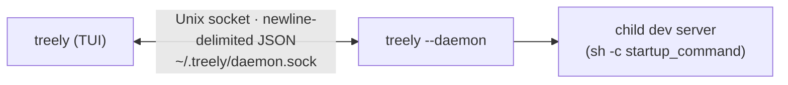
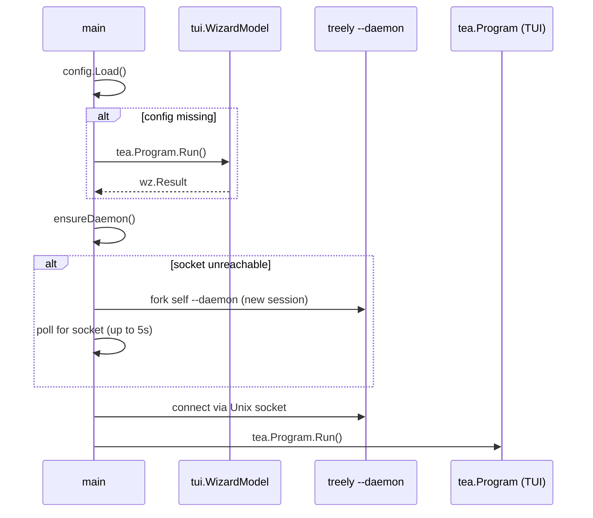
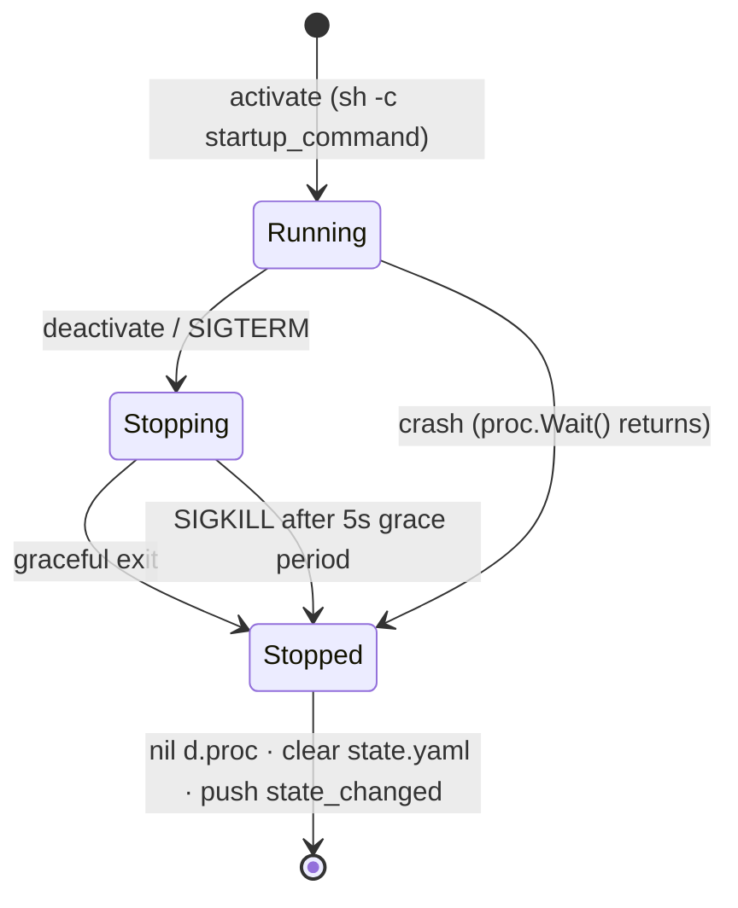
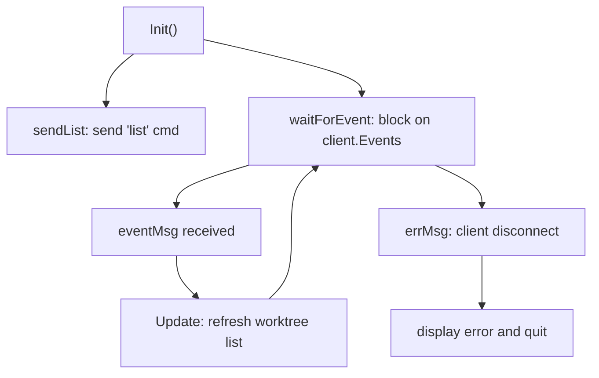

# Treely Architecture

## Overview

Treely is a single Go binary that runs in two modes: a **TUI client** (default) and a **daemon** (forked automatically on first run). The TUI is stateless — it delegates all process management and state to the daemon over a Unix socket.



---

## Package Structure

```
treely/
├── cmd/treely/               # Entry point; handles fork, wizard, TUI launch
│   ├── main.go
│   ├── daemon_unix.go        # Setsid for Unix detachment
│   └── daemon_windows.go     # CREATE_NEW_PROCESS_GROUP for Windows
└── internal/
    ├── config/               # ~/.treely/config.yaml (ProjectPath, StartupCommand)
    ├── state/                # ~/.treely/state.yaml (ActiveWorktree, PID)
    ├── daemon/               # IPC server, worktree discovery, process management
    │   ├── daemon.go
    │   ├── server.go
    │   └── process.go
    ├── client/               # TUI-side IPC client
    │   └── client.go
    └── tui/                  # Bubble Tea UI and first-run wizard
        ├── model.go
        ├── wizard.go
        └── styles.go
```

---

## Process Lifecycle

### Startup



### Daemon

1. Loads `config.yaml` and creates a Unix socket listener.
2. Calls `srv.Accept(d.handle)` — blocks forever. Each client connection runs in a goroutine.
3. Accepts only one client at a time; a new connection closes the previous one.
4. On clean exit: removes the socket file.

### Child Process



---

## IPC Protocol

Transport: Unix domain socket, newline-delimited JSON.

**TUI → Daemon (Commands):**
```json
{"cmd":"list"}
{"cmd":"activate","worktree":"/abs/path/to/worktree"}
{"cmd":"stop"}
```

**Daemon → TUI (Events, unsolicited push):**
```json
{
  "event": "state_changed",
  "worktrees": [
    {"path": "/abs/path/main", "name": "main", "status": "active"},
    {"path": "/abs/path/feature-x", "name": "feature-x", "status": "inactive"}
  ]
}
```

`"list"` and `"activate"` both return a `state_changed` event. `"stop"` returns nothing and closes the connection. The daemon also pushes unsolicited `state_changed` events on process crash.

**Deliberate type duplication:** `daemon` and `client` define their own `Command`, `Event`, and `Worktree` types with no shared package. This decouples the two sides of the socket — either can evolve independently as long as the JSON wire format is preserved.

---

## TUI Event Loop

`tui.Model` is a standard Bubble Tea model (`Init`, `Update`, `View`).



- `Init()` returns two concurrent commands: `sendList` (sends `"list"` and returns nil) and `waitForEvent` (blocks on `<-client.Events`).
- `Update(eventMsg)` refreshes the worktree list and re-arms `waitForEvent`, creating a continuous event loop.
- `Update(errMsg)` (client disconnect) displays the error and quits.
- Keyboard: `↑/k`, `↓/j` navigate; `enter/space` activates; `q/ctrl+c` quits.

---

## Worktree Discovery

The daemon runs `git -C <project_path> worktree list --porcelain` on every `"list"` command and parses the output. A worktree is marked `"active"` only when its path matches `state.ActiveWorktree` **and** `d.proc != nil`. There is no cached state — discovery is always fresh.

Worktree names are derived from `filepath.Base(path)` and assumed to be unique.

---

## Files at `~/.treely/`

| File | Owner | Purpose |
|------|-------|---------|
| `config.yaml` | TUI (wizard) | `ProjectPath`, `StartupCommand` — written once, read by daemon |
| `state.yaml` | Daemon | `ActiveWorktree`, `PID` — cleared on crash or stop |
| `daemon.sock` | Daemon | Unix socket; deleted on clean exit |
| `daemon.log` | Daemon | Child process stdout/stderr |

### config.yaml
```yaml
project_path: ~/Source/my-app
startup_command: npm run dev
```

### state.yaml
```yaml
active_worktree: /abs/path/to/worktree
pid: 12345
```

---

## Key Design Constraints

- **`-p` flag** overrides `cfg.ProjectPath` in memory after config load. It does not write to `config.yaml`. The daemon always uses the path from `config.yaml` for worktree discovery.
- **TUI is stateless.** It reconnects on each invocation. Multiple TUI instances can run simultaneously; only the latest one receives daemon events.
- **No crash state.** Crashed worktrees appear as `"inactive"` — there is no separate crashed status.
- **Single client at a time.** The server closes the previous client when a new one connects, preventing split-brain.
